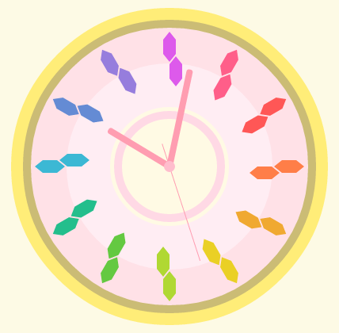

## HTML5 Canvas Projects

1. bezier
	- Simple drawing bezier curve process visualizer.
	- You can try this [HERE](http://takuti.me/dev/bezier/)
2. meltokei
	- [Create **meltokei** in HTML5 Canvas - blog.takuti.me](http://blog.takuti.me/meltokei/) (Japanese)
	- You can see this clock [HERE](http://takuti.me/dev/meltokei/)
	-	
